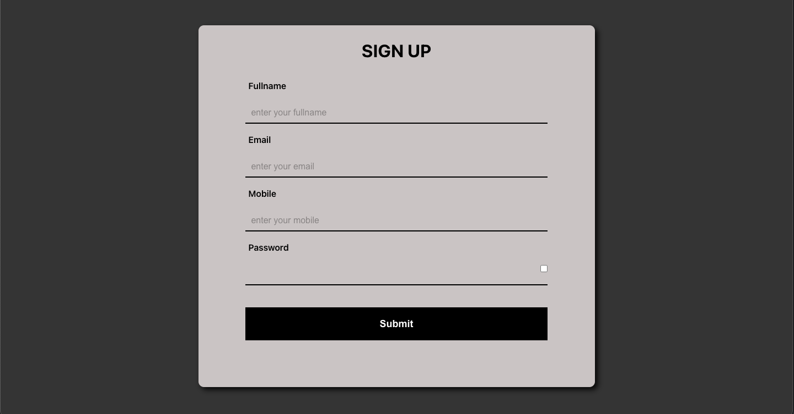

# React-Components

## Component 1 - Sign Up Form

- [x] With a little refactor, can be used for all forms

- [x] React hook used: `useState`, `useEffect`

## Component 2 - Light & Dark Mode Theme

- [x] React hook used: `useState`, `useEffect`

https://user-images.githubusercontent.com/85023604/175662045-c1f4b5ac-1dd0-46c0-b399-904b440546a0.mov

